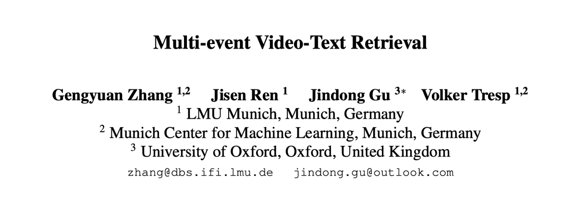
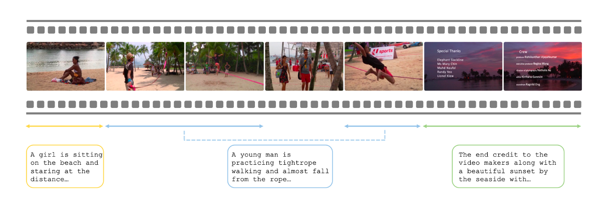

## Multi-event Video-Text Retriev

### Introduction
Official code for the paper "Multi-event Video-Text Retrieval" (ICCV 2023).


<!-- arXiv: https://arxiv.org/abs/2108.13684 -->



### Abstract
Video-Text Retrieval (VTR) is a crucial multi-modal task in an era of massive video-text data on the Internet. A plethora of work characterized by using a two-stream Vision-Language model architecture that learns a joint rep- resentation of video-text pairs has become a prominent ap- proach for the VTR task. However, these models operate un- der the assumption of bijective video-text correspondences and neglect a more practical scenario where video con- tent usually encompasses multiple events, while texts like user queries or webpage metadata tend to be specific and correspond to single events. This establishes a gap be- tween the previous training objective and real-world appli- cations, leading to the potential performance degradation of earlier models during inference. In this study, we in- troduce the Multi-event Video-Text Retrieval (MeVTR) task, addressing scenarios in which each video contains multi- ple different events, as a niche scenario of the conventional Video-Text Retrieval Task. We present a simple model, Me- Retriever, which incorporates key event video representa- tion and a new MeVTR loss for the MeVTR task. Compre- hensive experiments show that this straightforward frame- work outperforms other models in the Video-to-Text and Text-to-Video tasks, effectively establishing a robust base- line for the MeVTR task. We believe this work serves as a strong foundation for future studies.

### Datasets
Please use the [Google Drive link](https://drive.google.com/drive/folders/18Jj8Ce5_La8Ev8E6FSfdI1oMQtvU1d_3?usp=sharing) to download the annotation files of Charades-Event.

Please use the [original captions dataset](https://cs.stanford.edu/people/ranjaykrishna/densevid/) for ActivityNet Captions. 

Please download the raw videos for both datasets ActivityNet Captions and Charades from the official websites.


### Data preparation
We follow the data preparation steps from as described in [CLIP4Clip codebase](https://github.com/ArrowLuo/CLIP4Clip#data-preparing).

### Evaluation
``` sh
python -m torch.distributed.launch --nproc_per_node=2 \
--master_port=$MASTER_PORT \
main_task_retrieval_multi.py --do_eval \
--num_thread_reader=8 \
--data_path $TEXT_CAPTION \
--features_path $VIDEO_FEATURE \
--output_dir $OUTPUT_DIR  \
--max_words 77 --max_frames 64 --batch_size_val 16 \
--datatype activity --feature_framerate 1 --coef_lr 1e-3 \
--slice_framepos 2 \
--loose_type --linear_patch 2d --sim_header meanP \
--pretrained_clip_name ViT-B/32 \
--post_process cluster --post_cluster_centroids 16 \
--init_model $CKPT_PATH
```

### Acknowledgement
We thank the authors of [CLIP4Clip](https://github.com/ArrowLuo/CLIP4Clip) for their codebase.

### Citation
If you find this code useful for your research, please cite our paper:
```
@inproceedings{zhang2023multi,
  title={Multi-event Video-Text Retrieval},
  author={Zhang, Gengyuan and Ren, Jisen and Gu, Jindong and Tresp, Volker},
  booktitle={Proceedings of the IEEE/CVF International Conference on Computer Vision},
  pages={22113--22123},
  year={2023}
}
```